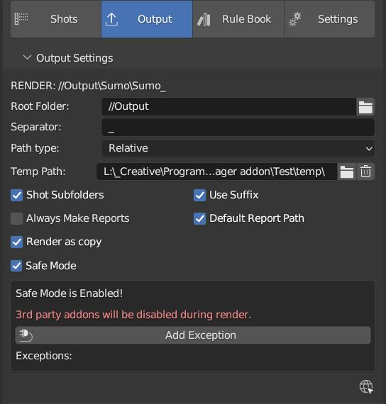
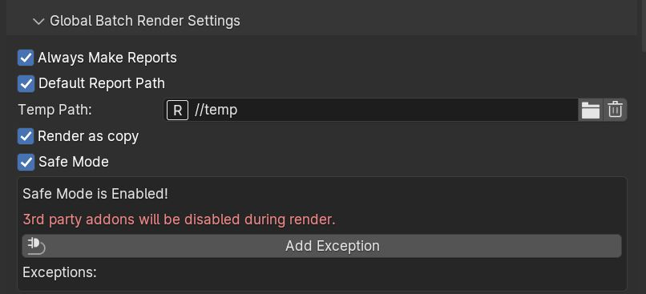
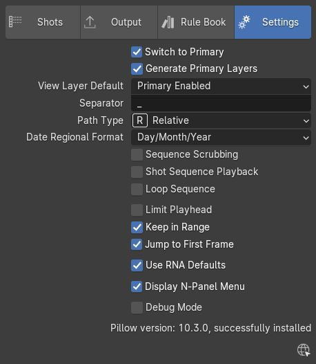
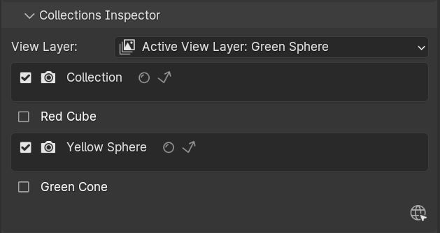
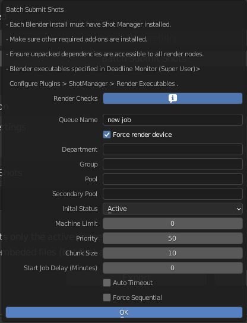

=============
Shot Manager
=============

https://twitter.com/OTrealms

:Version: 2.0.0

Getting Started
===============

Shot Manager is an add-on for Blender. Created as a tool by myself Pablo Tochez A. [contact@pablotochez.com] in order to assist in the organisation of complex files containing multiple shots, view layers and cameras. I am an artist with some coding knowledge for making time saving tools and digital artworks.

Shot Manager should be installed like any .zip add-on [Blender 2.8 Install Add-ons 00:38-https://youtu.be/14G_YIVdBd0?t=38]. 

 Make sure to remove any previously installed versions first and restart Blender.

You will not lose shot data uninstalling the add-on/
This documentation encompasses both the Lite and pro versions available on Blender Market.

 Version 2.0 and above do not support versions of Blender less than 4.0.

Updating from an 0.7 Shot Manager project
-----------------------------------------

 SM 2.0 can attempt to rebuild the Shot List from an older project, this must be done before making any changes or saving.

.. image:: LegacyLoad.JPG

 Note: Shot Rules and Output Pass Groups are not recoverable.
    
* **Save as Copy**, After rebuilding, the project will be saved with the suffix "_converted"

Render engine keys are preconfigured but may need to be re-mapped in some cases. 

In 0.7.7:

0=None, 
1= BLENDER_EEVEE, 

2 = BLENDER_WORKBENCH, 

3 = HYDRA_STORM if the old project was saved using Blender 4.0-4.1, otherwise CYCLES. 

4 = CYCLES if previously a Blender 4.0-4.1 file, otherwise a 3rd party render engine.

5= 3rd party render engine.

Alternatively:

Before installing SM 2.0, ensure the latest SM 0.7 is installed. Then Export via JSON backup.
Make a copy of the Blend file. Install SM2.0, load the copied file and import JSON. Some data may be missing that is no longer available. 
It is a good idea to use an older version of Blender such as 4.0 with SM 0.7 installed and keep this version for exporting JSON backups.

Shot List Data-Block
-------------------

A Shot List is a group of shots stored in a node tree data-block. This structure allows for sharing shots across scenes and blender files. A new editor type is created respectively and where new list overview nodes will become available with the development of Shot Manager 2.0.1+ . When starting on a new project, click New to create and link a Shot List to the active scene.

Creating a Shot
---------------

When making your first shot, you'll be asked for optional modes. These are preset settings for various workflows.

Three components will be created. A new **Shot List** , **Default Shot**, and a regular **Shot**.

MODE: Still Images
------------------

Defined by Default Shot and inherited by new shots.

Still Images are useful when rendering single frames such as product visualisation. Still Image Mode is used by the batch rendering queue like regular shot and can be rendered using any module. It uses the shot's Start frame and will output from all available output nodes.

MODE: Generate View Layers
---------------------------

Found in first shot creation popup and Settings tab.
 
This mode enables the following settings:

* Switch to Primary Layer, 
* Generate Primary Layers 
* View Layer Default to 'Primary Enabled'.

This work flow is designed for users who wish to create unique View Layers for each shot where different collections are visible per Shot. This work flow is most commonly used in product rendering and visualisation. When making a new Shot, a View Layer will be generated with the Shot's naming. The newly created View Layer will be set as the Shot's Primary Layer. The Primary Layer in combination with the other settings mentioned will become the active View Layer and will be renderable when the Shot is selected. It is therefore not necessary to alter the View Layer save/render states for the Shot. 

*Related functions:

 When a shot is deleted, an option also deleted its Primary layer will be given.

 If the shot name is changed, the Primary Layer name can be matched in the View Layers states editor.

 New collections created using SM New Collection (Outliner) may be given the Shot's name and is enabled only in the active View Layer.
 This will allow per Shot, per layer objects.

'Default Shot' and Inheritance
------------------------------

The Default shot is intended for property defaults, general editing and previewing and is not recommended for batch rendering or exporting. This is the basis for regular shots. 
Shot data hierarchy is as follows; 

Scene Settings -> Default Shot -> Shot -> Linked Shot. 

Properties that are left empty i.e. Camera or not overridden on linked shots will be inherited down the chain.

Some 'base' properties are not heritable, these depend on the shot's type and include; 

Default Shot: 

* Name
* Still Image
* Output Generators (PRO)

Regular Shot:

* Name
* Suffix
* Still Image
* Notes
* Output Generators (PRO)

Linked Shot:

* Notes

Linked Shots
------------

Linked shots reference data from an existing shot for all properties unless overridden. These can be used for multi-cam set-ups where multiple cameras are used to render a scene but retain the same base filename and file path. Shots can be linked from any Shot List.

 NOTE: If not overriding frame range to unique frames, these images will overwrite each other when batch rendering unless Path Constructor nodes are used to make more unique file paths. For example, overriding the shot's Camera with a Camera Path Constructor, will give a unique path or filename.

Linked shots can also be used to re-render sections of shots without losing their original frame range.

Shot Operations
===============

1. **New Shot** , Adds a new shot to your list.

2. **Duplicate** the active shot.
3. **Join** two shots including frame ranges. Options **Delete Target** = Deletes the target shot, **Assimilate View Layers** = Adds View Layer states to existing, **Assimilate Rules** =Adds Rules to existing.
4. **Split** , Divide a shot, creating a duplicate at the given frame.
5. **Copy From Shot** , Copy data from another shot. Select source shot name followed by specific data or 'All'. **Apply to all queued shots** will copy the source data to all queued /enabled shots.
6. **Add Links**, 
7. **Move Shot to index**, Move the active shot to another index for fast reordering.
8. **Delete** the selected shot.

Main Panel
==========

The main interface is found in the 'Properties' panel under the Output tab.

* **Enable**, The first checkbox will toggle the affect of Shot Manager on your scene. Uncheck if you need to turn off its influence, particularly if rendering alternative frame ranges or View Layers.

UI: Shots
=========

* **Queue Count**, Displays the number of shots in the local list enabled for render queue.

* **PRO: Render Queued Shots** Batch render shortcut.
* **Index**, An convenient way to activate a shot.
* **Set**, Filter visible shots by colour set.
* **Queue All/None Toggle**, add all shots to the output/render queue.
* **Invert Queue Toggle**, Invert the enabled shots.
* **Shot Operations**, see :ref:`Shot Operations`

**List Area**

* **Enable/Queue Shot**, Check Box used to add shot to output/render queue as well as perform batch functions such as Delete queued, Copy From queued.

* **Lock**, Prevent accidental changes by locking a shot's interface.
* **Arrows Up and Down** will sort your shots and render order.
* **Activate Camera**, Activate the shot's camera if it has been defined in its properties and exists within the active view layer.
* **Colour Set**, Assign a colour tag to the shot to use for filtering.

**Drop Down Area**

* **Search**, Filter visible shots by name or partial text.

* **Reverse**, Reverse the displayed order of shots.
* **Show Suffix**, Add the Shot's suffix to it's displayed name.
* **Show Camera**, Show the **Activate Camera** buttons.
* **Linked Shots**, Show/Hide linked Shots.

**Shot Source**, Source Shot List -> Source Shot. See :ref:`Linked Shots`

Filtering and Colour Sets
-------------------------
Shots can be filtered from the list by keyword or by colour set.
 NOTE: Filtering does not affect the render queue and is only for visibility, sequence playback and scrubbing.

Colour sets can be assigned to each shot within the list panel and filtered in the dropdown below the list (properties panel) or above in the quick panel. They will also determine the strip colour in the Shot Overlay.

Shot data
---------

.. image:: ShotProps.JPG

Each shot contains its own data set that may include any of the following:

Properties
-----------

 The following properties cannot be deleted:

* **Shot Name**, A unique name for your shot, this will also be an output subdirectory and filename for the shot.(Best practice is to avoid spaces)

* **Suffix** Add a suffix to the shot's display name and output filename.
* **Primary Layer**, select a View Layer that will become activated when selecting the shot if 'Switch to Primary' is enabled in settings. Also used as a default render layer if 'Unpinned default' is set to 'Primary Only' (View layer tab).
* **Still Image** 
* **Start**, Start frame.
* **End**, End frame.
* **Notes**, for shot descriptions.

 Shot Properties can be added and managed in the Default Shot Properties. See :ref:`'Default Shot' and Inheritance`

**Optional Properties and RNA paths**

* **Background Scene** = background_set
* **Bloom** = eevee.use_bloom
* **Camera** = camera
* **Cycles Denoise Render** = cycles.use_denoising
* **Cycles Max Bounces** = cycles.max_bounces
* **Cycles Max Samples** = cycles.samples
* **Cycles Max Viewport Samples** = cycles.preview_samples
* **Cycles Motion Blur** = render.use_motion_blur
* **Eevee Motion Blur** = eevee.use_motion_blur
* **Eevee Samples** = eevee.taa_render_samples
* **Eevee Viewport Samples** = eevee.taa_samples
* **Exposure** = view_settings.exposure
* **Frame Rate** = render.fps
* **Frame Step** = frame_step
* **Gamma** = view_settings.gamma
* **Render Engine** = render.engine
* **Resolution Scale** = render.resolution_percentage
* **Resolution X** = render.resolution_x
* **Resolution Y** = render.resolution_y
* **Simplify** = render.use_simplify
* **Time Stretch New** = render.frame_map_new
* **Time Stretch Old** = render.frame_map_old
* **Transparent Background** = render.film_transparent
* **View Transform** = view_settings.view_transform
* **World** = world
* **Timeline Markers** = sm_general_props.marker_set (PRO☆)
* **File Format** = render.image_settings (PRO☆)

View Layers
-----------

View layers pinned states include ;

* unpinned/not renderable
* unpinned/renderable,
* pinned/renderable 
* pinned/unrenderable.

Unpinned layers will fall back to the value determined by the **View Layer default** option.

* **Primary Layer**, select a View Layer that will become activated when selecting the shot if 'Switch to Primary' is enabled in settings.

* **View Layer default**, See :ref:`UI: Settings`
* **Clear Pins/Pin All** Save or unpin all view layer states.
* **Enabled and Primary Only** Only displays the renderable view layers for the active shot.
* **'AB'** icon: Rename the Primary Layer to match the shot's name.
* **'Link'** icon: Indicates the view layer is the shot's Primary Layer and can be clicked to reassign the layer.
* **'Broken Link'** icon: the shot name is identical a View Layer's name, click to choose a Primary Layer.

Shot Rules
-----------
**Pro Feature ☆**

Here rules can be assigned, toggled and overridden (RNA, Python Variables) per shot. Rules should first be created in the Rule Book, see :ref:`UI: Rule Book`.

**List Drop Down**
* **Search**, Filter Rules by text input.
* **Sort By Type**, Sort Rules by their method type in alphabetical order.

UI: Output
==========

Shots can be rendered using the regular 'Render Animation' or still operators (Ctrl+F12/F12). However only the active shot will be rendered. Shot Manager provides several batch rendering and export options.

Output Settings
---------------

* **Root Folder** will be the starting directory for shots.

* **Separator**, A custom separator to add between filenames and frame suffix, default is underscore '_'.
* **Path Type**, Absolute or Relative output path creation. Affects; Root Folder, Temp Folder and Render Log Folder.
* **Shot Subfolders**, When enabled, add a unique subfolder to the output path with the shot's name, separating it from other shots. Disabling this will lead to shots being rendered to the same folder which potentially could cause accidental overwrites when using generated output nodes.
* **Use Suffix**, Add the shot's suffix to the shot's file path.

Global Batch Render settings
----------------------------

* **Always Make Reports**, Generate CSV render reports after rendering the first frame of every command.
* **Use Default Report Path**, Use the default path (output directory) or define a custom report path.
* **Temp Path**, The directory that will store temporary job files for the integrations/ submitters. Click trash can to clear files recognised by Shot Manager.
* **Render As Copy**, Save a Blend file when using SM render specifically for rendering. Large files make take more time however it will prevent inconsistencies if the file is changed.IMPORTANT: Simulations using the Disk Cache option are not supported.
* **Safe Mode**, When batch rendering, Blender will be run using factory start-up settings, disabling 3rd party add-ons that might interfere with the render process. Render devices are then forced and add-ons in the exceptions white list will be enabled.
* **Add Exception**, Allow specific 3rd party add-ons to be enabled during batch render.

Render List
------------
**Pro Feature ☆**

**+Add Scene**, Either add scene's and their associated shot lists from the open project. Local shots will be automatically linked, so any changes will be reflected in the queue. 

**+Add From .blend**, Add a render list from another Blender file via JSON. External shots will not be imported, only added to the render queue.

External Scenes can be filtered by listing scene names to include.

* **Reload External Scenes**, External shots must be reloaded to reflect any updates to the shot list and frame ranges. Only already loaded scenes will be included, and any render queue overrides will be reset.

* **Show Render Time**, Display completed render times in the queue
* **Override Frame Range**, This will use an alternative frame range to batch render/submit shots, available for both internal and external shots.
* **Inspect Output** Display shot output file path details and image preview. When opening a preview in Blender Viewer, the images contained in the directory will be displayed and played using the scene's frame rate. Use numpad buttons 0-9 to control frame rate, 9 is slowest. Arrow keys left and right will pause and increment current frame. Press Enter to play animation. Esc key to close window.

Batch Render
-----------
**Pro Feature ☆**

see :ref:`Batch Rendering`.

UI: Rule Book
==========
**Pro Feature ☆**

Shot rules are a powerful way to override data blocks and properties.
Rules are defined in the Rule Book panel. Once created in the Rule Book, they can be assigned to shots. RNA Rules can be used as Macros. There are many types of rules which target various data types.

Rules and Variables are shared (global) across Scenes.

* **Source**, The source Scene to display. This does not affect access to Rules or Variables and is only for interfacing. 

* **Method**, The type of Rule  you wish to define.

Swap Rules - Materials, Mesh Data, Cameras, Lights
----------------------------------------------

Swap Rules follow the principle of; replace data A with data B, if a collection filter is defined, the affect will be restricted to that collection. Rules defined in the Rule Book can then be re-used by assigning them to the shots individually. If the following shot doesn't have a rule, the data block will be reset to its original/default state. Caution: large scenes with many objects may take longer to switch between shots.

* **Filter**, use the collections filter to limit overrides to objects within the filter collection.

* **Type**, Material overrides have two source types. 'Data' refers to materials stored in the objects mesh data block. 'Object' refers to the containing object data. See Blender's documentation for material link. https://docs.blender.org/manual/en/latest/render/materials/assignment.html#material-slots
* **Use A as Default**, Revert data back to data-block A when a Rule is not assigned or enabled.

RNA Rules
-----------

RNA encompasses Blender's scene properties. 
RNA Rules are able to override just about any data type in Blender. For example, scene render settings, object visibility and even custom properties. They are useful in extending the Shot data beyond the available options and are easier to use than Python Rules. They can also be used in combination to create Macros, see :ref:`Macros`.

First choose the source type of the property you would like to override, this will be the 'Domain'. If it is a scene or render setting choose 'SCENE'. For all other types, you may then need to choose a more specific domain. Next specify the data path.

 Note: that Domains such as Camera, Light and Mesh will point to shared data-block, not an object, for example, to override a Camera's position, use Domain = Object -> Path = 'location'. In Blender a data-block may have several users.

To override the same camera's focal length the path should be 'data.lens', 
To override all cameras sharing the same camera data-block, use Domain = Camera -> Path = lens.  

The simplest way to find a data path is to right-click a property in Blender's interface and left click 'Copy Data Path, then paste it into the Path text box. The path should be relative to the domain's data type. 

* **Domain**, Point to the specific data object which contains the property to override.

* **Path**, The property's data path relative to the source. Custom Properties should use double quotations i.e. ["Prop"]
* **Paste Current Value**, Copy the properties current value to the default value.
* **Default**, The default value to revert to when the rule is disabled or not assigned to the active Shot.
* **Use Default**, Choose whether to revert to the default value when the rule is unassigned.
* **Override**, The value to set this property to when enabled and assigned.

* **Assign Rule** to active shot

**List Dropdown**

* **Search**, Filter by name.
* **Type Tabs**, Filter by method type.
* **Sort By Type**, Order Rules by method type.
* **Active Shot Only**, Only display rules assigned to the active shot.

Python Rules
-------------

Python Rules contain python code to be executed every time an assigned Shot is activated. There is no need to import or define the following names:

**'bpy', 'context','scene','data', 'Vector','rule'(assigned Rule) and 'shot'** are already provided in the name space. Please beware that very long code may slow down shot changes. Deep code might make Blender unstable. Python Rules are called after the majority of updates when activating a Shot. Python rules can be made revertible using variables as defaults values.

* **Expression**, A single line of code.
* **Text File**, Read python code from a text block.

Variables
---------

When making Python Rules, variables can be declared i.e. 'x = 10', and then defined in the variables list. 

* **Name**, The variable name i.e. x
* **Default**, The value first given to the variable. 

When setting a default the data type will be determined and should remain the same wherever used. Python Variables can also be assigned values per shot when the Rule is assigned. Variables are stored within scenes but can be accessed in any scene and are therefore global.

Supported data types:

* bool
* int
* str
* float
* bpy_prop_array
* Material
* Color
* Vector
* Quaternion
* Object
* World
* Scene

Macros
--------

Macros in Shot Manager are a list of RNA Rules to be executed manually on click. These are useful when working with multiple settings without needing to assign RNA Rules to shots. For example, enabling/disabling camera overlays or a rig bind pose position. Macros can be reverted by using default values.

All RNA Rules in all Rule Books within the Blender file will appear under the Macro. Enabled Rules will activate the rules 'Override' value, disabled Rules will use the Rule's 'Default' value.

Macro's can also be executed from the SM Tools panel and the 3D view right panel -> Shot Manager.

UI: Settings
============

* **Still Mode** , Use a single frame for shot timing.
* **Switch to Primary**, make primary layer the active view layer when choosing shots.
* **Generate Primary Layers**, a new View Layer will be created with the name of the newly made shot and associated as a Primary Layer
* **View Layer Default**, (On, Off, Primary Enabled and Default). The default state of View Layers if they have no saved state for the active shot. 'On' will make all unsaved layers renderable by default with each shot change/trigger. 'Off' will default to unrenderable, choose 'Off' to prevent unsaved view layers from rendering. 'Primary Enabled' will also switch all unsaved layers to unrenderable, except for the Shot's Primary Layer. 'Default' will derive unpinned states from the DEFAULT shot.
* **Separator**, a custom separator to add between filenames and frame suffix, default is '_'

* **Path Type**, Absolute or relative output path creation.
* **Sequence Scrubbing**, Allow scrubbing through shots in sequence. Not compatible with 'Limit Playhead'
* **Shot Sequence Playback**, Switch shots in sequence while playing animation.
* **Loop Sequence**, After playing through each shot, loop back to the start.
* **Limit Playhead**, Don't allow frame to be selected with mouse outside of frame range
* **Keep in Range**, view timeline to playhead when choosing shots.
* **Jump to First Frame**, place playhead at start of frame range when choosing shots.
* **Use RNA Defaults**, (Shot Rules) Use default values when an RNA rule exists, but the value hasn't been set yet.
* **Debug Mode**, For displaying extra debug messages in console

UI: Overlays
============

.. image:: Overlay.JPG 

Overlays include, Output Summary, Notes, basic shot info and the Shot Sequence Editor. Toggles and opacity settings can be found within Blender's Overlay dropdown. Scaling is adjusted to follow Blender's settings in Preferences -> Interface -> Resolution Scale. Further scaling can be applied.

Overlay Options
-----------------

Detailed overlay settings are found within 3D view side panel ('N' Panel).

* **Overlay Scale**, Text and UI size. Added to Blender's UI Resolution Scale in Preferences. This setting is stored in the add-on preferences.

* **Text Offset**, Offset overlay text so that it doesn't collide with other UI elements. Stored in add-on preferences.
* **Shot Basics**, Displays the active Shot name and render camera as well as the relative Shot frame and seconds. SM batch render progress will also be displayed here.

* **Output Summary**, Displays render and output information.
* **Display Notes**, Shot notes will appear in the bottom centre of the 3D window. Shot notes can be found in the Shot's properties.
* **Sequence**, Toggle Shot Sequence Editor visibility.
* **Collapsed**, Toggle between a stacked layout or collapse linear layout for the Shot Sequence Editor. 
* **Auto Collapse**, Reduce the Shot Sequence Editor to a minimal layout when not using the Shot Edit Tool.
* **Zoom Width**, Scale Shot strip width.
* **Zoom Height**, Scale Shot strip height.
* **Slide**, Adjust Shot Sequence Editor height.
* **Scroll**, Scroll Shot Sequence Editor.
* **Opacity**, Shot Sequence Editor opacity, may be overridden by camera passerpartout settings when in camera view to avoid blending issues.

Shot Edit tool
--------------
**Pro Feature ☆**

Many shot operations are available when using Shot Edit Tool in combination with Shot Sequence Editor. Found in the 3D view toolbar.

In addition to the sequence overlay, drop down menus are available in the tool header including Shot Data, View Layers and Rules.

**Sequence Playback options:**
* **Shot Sequence Playback**, Switch shots in sequence while playing animation.

* **Loop Sequence**, If Shot Sequence Playback is enabled, optionally loop back to the start after playing the last shot.
* **Flattened Playback**, If Shot Sequence Playback is enabled, play shots in linear timeline order rather by shot index. This will activate shots when they are overlapping.
* **Sequence Scrubbing**, Switch between shots when scrubbing (sliding) the timeline or shot sequence playhead.

If there were permission issues when installing, the Shot Edit Tool icon may appear as a pair of scissors.

Shot Sequence Editor
---------------------
**Pro Feature ☆**

The Shot Sequence Editor acts as an overlay only unless the Shot Edit tool is active.

* **Left Mouse Click** on a shot strip to offset its timing or end handles to trim. Hold **SHIFT** to enable snapping to the nearest shot. 

* **Right Mouse Click** on a strip to bring up a context menu.

* **Box Selection**, Click + hold outside a strip or press 'B' to start a box selection. Drag the selection box over shot handles to select them for moving and trimming.

* **Mouse Wheel**, scroll wheel to scale editor horizontally. Hold **SHIFT** to scale vertically.

* **Press K**, knife tool. Slice shots at mouse click into two. Hold click a drag to place slice.

* **Press J**, Join tool. Click and drag to merge a shot with it neighbour. A popup box with options will appear.
* * **Delete Target**, Delete the target shot. Disable to keep the shot.

* * **Assimilate Layers**, Add the target shot's View Layer states to the resulting combined shot.

* * **Assimilate Rules**, Add the target shot's Rules to the combined shot. 

**Right Click Menu**

By right-clicking a shot strip, some basic shot values can be edited. If the Shot is not active the right arrow → button will activate it.

UI: SM Tools
============

* **Run Macro**, Trigger a Macro, see :ref:`Macros`
* **Delete All Shots**, Empty the active scene's Shot List. Optionally delete assigned Primary Layers or delete the scene's Rule Book.

View Layer Settings
-------------------

This interface is for overseeing the states of View Layers, in particular, their render passes and light passes. It removes the need to switch between view layers in order to edit them. 
These settings are built into Blender and do not show overrides and are not in any way related to Shot Manager. For per shot layer settings (pinning) see :ref:`View Layers`

Collections Inspector
---------------------

An alternative interface for overseeing and modifying collection states per View Layer. This aims to bring back the kind of oversight possible in Blender 2.7 where layer visibility, holdout and indirect states were laid out in view layer settings. It can also be used to keep track of very complex scenes with many nested collections. Setting the View Layer to 'Active View' will use the currently active view layer. Changing the view layer in the dropdown menu will not change your currently active view layer. This can be quicker in large scenes to avoid loading objects.

Output Viewer
-------------

Used to count matching output files in all output paths. If a folder or file is detected you may click the folder icon to open the directory in your OS explorer or click the image icon to load it in a Blender Player. Files are counted when the refresh button is clicked. Only file containing the output filenames and extension are counted, therefore there may be other files in the directories that are not counted. 

* **Refresh** , Update the Output Viewer list.
* **Open Directory** , The folder exists and can be opened in an OS file explorer.
* **View Output** , The images contained in the directory will be displayed and played using the scene's frame rate. Use numpad buttons 0-9 to control frame rate, 9 is slowest. Arrow keys left and right will pause and increment current frame. Press Enter to play animation. Esc key to close window.

JSON Backup
-------------

It is a good idea to backup shots from time to time, especially when updating or re-installing the add-on. A JSON text file can store information about each Shot's properties as well as general settings for the add-on. However, it cannot store scene or object data, such as cameras. Instead, it will store the camera's name and try to find a match when loading. Other data that are **not** stored are View Layer States (they're stored in the layers themselves), Rules and Macros.

**Export JSON** 

Export shot data to json to backup or transfer shots.

* **Include Shot Manager Settings**, include settings from the Shot Manager settings panel.

**Import JSON**

Import shot data from a saved json file. Import support Shots from version as old as SM 0.6. Some data may be lost that has no equivalent in 2.0, this includes Alias Shots.

* **Include Shot Manager Settings**, include settings from the Shot Manager settings panel.

* **Replace Default Shot**, If an imported shot is marked default use this as default. IF the Shot List is empty assign a new Default shot, may use the first index if the json is from an older version of Shot Manager, less than 2.0.
* **Scenes**, Enter Scene names to include, empty imports all.
* **Match Scenes by Name**, Importing scenes does not create new scenes, instead it appends shots to the active Shot List. Attempt to match the Shot Lists by scenes name found in the JSON.

Marker Sets
-----------

Marker Sets are groups of timeline markers. Only one set is visible at a given time. To setup a set, add a marker set, define a name and create timeline markers as per usual. Upon making a new set or changing the active set, the previous set will be saved. Marker sets can be assigned to shots by adding the Timeline Markers property in the Default Shot properties (PRO☆).

Simplified interface also found in timeline right panel ('N' Panel).

Batch Rendering
===============
**Pro Feature ☆**

Shot Manager Pro supports the following batch render options:

* **Viewport Render**, Playblast renders of the active scenes Shot List.
* **SM Batch Render**, Oversee and submit renders within the Blender interface. Supports all render lists.
* **B-Renderon**, launcher/Submitter. Supports all render lists.
* **Flamenco**, Submitter and job type. Supports all render lists.
* **Think Box AWS Deadline**, Submitter and plugin. Supports all render lists.
* **Batch files**, see :ref:`Batch Export` Executable .bat files(Windows).
* **Blend files**, see :ref:`Batch Export` Useful for cloud rendering. 

**Make Pre-Render Report**

Render the first frame of each shot and generate a report CSV containing true scene settings returned by the render process. Supported by all submitters.

SM Batch Render
---------------
(Windows, Linux, MacOS X)

Requirements:

* Shot Manager Pro

SM Render is Shot Manager's local batch rendering module. It will perform a background render thread for each shot sequentially in the render queue for single machine rendering. It is possible to render shots from other scenes, as well as other Blend files. SM Batch Render is the only render module that will fully utilise the Render List. Render progress will be displayed in the render queue alongside estimated render time, as well as in the 3D view text overlay.  

TIP: If RAM is an issue, make an empty Scene as the master scene for queuing and rendering.

To batch render, Shot Manager will attempt to assign the hotkey Ctrl+Shift+F12, however sometimes this may need to be manually assigned.

Viewport Render (Play Blast)
-------------------------

OpenGL viewport rendering also uses the Export module. Only the local scene's shot list can be batch rendered and this is not available as a background process. Found in SM Batch Render settings and Batch Export. Supports render frame range overrides.

B-Renderon! Submitter
---------------------
(Windows, Ubuntu)

Requirements:

* B-Renderon Application

B-Renderon is a paid standalone local render manager especially for blender. Available on BlenderMarket.com 

Launch B-Renderon with shots preloaded. Temporary job files are created in the temp folder. These files are used to access individual shots from the project render file. The render file is created in the same directory as the source .blend file with the suffix '_renderfile'. Requires B-renderon v3 or above. The executable path for B-renderon must first be entered in Blender Preferences -> add-ons -> Shot Manager settings   

* **Queue Name**, Open B-Renderon with shots associated with a given queue.

* **Add to existing queue**, Append the shots to the given queue if matching name, otherwise clear all shots and overwrite the queue.
* **Force Cycles Device** to ensure the correct CPU/GPU configuration is applied to renders, assuming the submission machine is or is identical to the render machine.

Flamenco Submitter
------------------
(Windows, Linux, MacOS X)

Requirements:

* Flamenco 3.5+, containing Manager and Worker.
* Flamenco 3.5+ Blender Add-on

Flamenco is a free network distribution render manager supported by the Blender Foundation. It runs an in-browser interface. The following steps are required;

1. Download Flamenco  https://flamenco.blender.org/download/ 

2. If Flamenco has not been used, run Flamenco Manager and follow setup steps, otherwise ensure settings are correct in the flamenco-manager.yaml. 

3. Install the Blender add-on of the same version (3.5+). Run Flamenco Manager in browser to find download link. i.e. Run Flamenco Manager and go to default http://localhost:8080/

4. Configure the add-on in Blender Preferences. Job Storage should be a shared location.

5. Install the Shot Manager Job Type

6. Run Flamenco Manager

7. Open Browser interface

8. Submit to Flamenco

9. Run a flamenco-worker

* **Priority**, Higher numbers will give the render task higher priority
* **Chunk Size**, The number of frames to render per task. Smaller chunks results in more sharing across render nodes. Use higher values for simulations and larger files with long build times. Too many chunks may add some extra delay in launching Blender and render engine initialisation.
* **Ignore Version Mismatch**, Attempt to submit render even if the Flamenco add-on and submitter doesn't match the manager.

Deadline Submitter
--------------------
(Windows, Linux, MacOS X)

Requirements:

* Deadline Monitor 10+
* Deadline worker 10+

Thinkbox Deadline is a network distributed rendering and management software owned by Amazon. It is free but requires an AWS account and personal details for verification. Shot Manager provides a custom plug-in for Deadline 10.3+ and Deadline submitter within Blender. Cloud rendering is not recommended using this module, instead shots should be exported as separate Blend files using Batch Export see :ref:`Batch Export`.

The Deadline Repository must be installed on a shared location. Each render node should have the most recent version of Shot Manager installed. The Deadline render Client/worker must be installed on all render machines and Deadline Monitor should be installed and accessible by the 'Master' PC. Shots should be submitted using the Master PC. 
https://docs.thinkboxsoftware.com/products/deadline/10.1/1_User%20Manual/manual/install-db-repo.html

* **'Error encountered when loading the configured Client Certificate'** This is a certificate issue with your install of Deadline, please see: https://forums.thinkboxsoftware.com/t/basic-setup-issue/24229/9 When installing the Deadline repository it is simplest to leave 'use SSL' unchecked and set 'full read/write access' in the install wizard.

**Setup**

Once installed, simply click **Setup/Update Plugin** in the Deadline sub-panel to install the plug-in. This will transfer required files to the repository>custom>plugins folder. 

All enabled shots for enabled scenes in the render list will be submitted. Ensure that the **Temp Path** is not empty and set to the desired location. This does not need to be a shared location. In most cases the required Deadline Command will be found automatically however if using macOS/Linux there is a chance it will need to be located manually.

* Windows looks like: \Program Files\Thinkbox\Deadline10\bin 
* Mac OS looks like: /Applications/Thinkbox/Deadline10/Resources
* Linux looks like: /opt/Thinkbox/Deadline10/bin

**Configuring the Plugin**

To verify that the Shot manager plugin is installed and to configure Blender versions, open Deadline Monitor > Tools > Configure Plugins. You must enable Super User Modes to access these settings. 
For each Blender Executable you can enter a series of filepaths to look for separated by semicolons ' ; '. 

For example, 

* **Render Executable 1**

* **Blender Executables** C:\Program Files (x86)\Blender Foundation\Blender 4.1\blender.exe;D:\Programs\Blender Foundation\Blender 4.1\blender.exe;/Applications/Blender/blender.app/Contents/MacOS/blender

* **version** 4.1

**Submitting a Shot**

* **Queue Name**, The folder name for containing job files, using unique names avoids overwriting older submissions.
* **Force Render Device**, Force the current file's render device i.e. CUDA, Optix, CPU.
* **Department**, Extra info visible in Monitor.
* **Pool**, Assign jobs to pools defined by Monitor's Pool Management.
* **Secondary Pool**, Specifies the secondary pool that the job can spread to if machines are available.
* **Initial Status**, Determines the initial status for jobs. Active will start rendering immediately.
* **Machine Limit**, Limit the number of machines dedicated to the submitted jobs.
* **Priority** Determines the order in which renders will execute. Lower values indicate higher priority in the job list.
* **Chunk Size**, The number of frames to render per task. Smaller chunks results in more sharing across render nodes. Use higher values for simulations and larger files with long build times. Too many chunks may add some extra delay in launching Blender and render engine initialisation.
* **Start Job Delay** Specifies the time, in minutes, a Slave has to start a render job before it times out.
* **Auto Time-Out**, Automatically figure out if it has been rendering too long based on some Repository Configuration settings and the render times of previously completed tasks.
* **Force Sequential**, Forces a slave to render the tasks of a job in order. If an earlier task is ever re-queued, the slave won't go back to that task until it has finished the remaining tasks in order.

Batch Export
============
**Pro Feature ☆**

Export shots enabled in the shot list sequentially as a given format.
Batch export only exports the active scene's queued shots and does not support shots from external Blend files.

Export formats currently include: 

* BAT, Windows Batch file
* Blend, Shots as separate Blender files. All shots are retained but activated per output file.
* FBX, Allows shots embedded as animation layers.
* OBJ
* ABC (Alembic)
* USD (Universal Scene Description)
* DAE (Collada)
* Viewport Render(Playblast)

All options include an 'Add Prefix' option. Exported files will assume the associated Shot Name, with the optional prefix prepended. Exceptions are **BAT** and **FBX** when using the combine/embed options. In this case, the default filename will be the Blender file's name. To override, simply replace the provided name i.e. "Filename is Shot name unless using 'Embed Shots'"

Options **BAT** and **BLEND** Will automatically remap relative output paths to their original locations, while remaining relative. For example '//Output' will turn into '//' if being exported to the //Output directory.

**FBX** 

The FBX Exporter is a modified exporter capable of embedding shots as Animation Layers. This is suitable for linear timelines as traditionally used by game animators and later split into sections in a game engine. This will make some options in the Animation tab unavailable.
FBX version 7400  

Embedded shots can store frame ranges and shot names as animation layers and extracted in other software i.e. Unity.

**BAT** 

Batch files are used by Windows to execute command-line rendering. Either export separate files, per shot or a single batch file containing an execution list. Simply open the file to begin the render process. Be sure not to move the source Blend files as references to those files will be lost.

* **Relative Execution Path**, Keep paths to Blender files relative.

Burn-Ins
========
**Pro Feature ☆**

Burn-Ins, also called video stamps or metadata burn-ins, are useful when reviewing and editing large numbers of scenes in an animation, while keeping track of cameras, frame ranges, time codes and files paths etc. Shot Manager provides a highly flexible Burn-Ins editor capable of displaying just about any data. This feature is **currently only for use with batch/background rendering**. 

Installation
------------

To set up Burn-Ins navigate to the Image Editor and expand the SM Burn-Ins tab. The PILLOW python library should first be installed, internet connection required. PILLOW is an image processing python library. 

* If the installation fails, try closing Blender and opening it with administrator privileges. 

* Check the Blender terminal/console for any errors

* If it doesn't have the required write permissions, it could be due to the directory or disk location Blender is installed to.  

* If it continues to fail, copy errors from the terminal/console and report them.

Getting Started
---------------

Once installed, choose a Canvas. It should be an empty, generated image. Enabling **Match Render Size** ensures the canvas will match the output settings, even if it changes between shots. 

This image can then be used in the compositor. It may also be useful to insert a Scale node, Fit to Render. This will ensure the image fits if the output resolution percentage is not 100%.

You may load an alternative font, the default 'DejaVu Sans' is also known as Bfont Regular, the Blender's default font. Any complete, True Type font can be used. For non-Latin text, there are more fonts provided in Blender Foundation/Blender 4.1/4.1/datafiles/fonts or your local OS Fonts folder. The top Font and font size options will be the default value text values, these can be overridden per stamp.

Start adding stamps either by clicking new Stamp or by loading a preset. Stamps are drawn in order from top to bottom.

Stamp Items:

* **Text**, Plain text, mostly for headings/titles, the stamp's name will be the input text.

* **Property**, Similar to a text stamp with the addition of deriving input from a property. Include Label will prefix the text with the stamp name. The property RNA path belongs to a given domain.  Domains include: 
* * **Scene**, The active scene, e.g. path = name to gather the scene's name 
* * **Context**, e.g. path = camera.name to gather the active camera's name 
* * **Active Shot**, Shot properties are not accessed like typical RNA paths. See text suggestions in path input text box. If the property is a data-block such as World, there is no need to access world.name. Suggested property names are derived from the Default Shot but will use the active shot's values or inherited values. 
* * **bpy**, The base path for accessing the Blender API. e.g. Path = data.filepath will access the Blender file path.

* **Time-Date**, Add timecode, time and date information. Include label refers to labels of individual options.
* * **Time Code**, Linear Time Code, Hours/Minutes/Seconds/Frames. For total scene time.
* * **Shot Time Code**, Linear Time Code for shot time, shot always starts at 00/00/00/00.
* * **Time Duration**, Shot duration in clock time.
* * **Frame Duration**, Shot duration in frames.
* * **Date**, Current Date. Uses Date Regional Format in Shot Manager -> Settings tab.
* * **Clock Time**, Current local time, 24hr.

* **Box**, Create a simple box with a colour fill
* **Image**, Insert an image, load data-block from the image editor first. Useful for logos and watermarks. Supports most formats supported by Blender except open EXR.
* **Group**, Contains stamps in groups to override their visibility, offset positions and colour tag them.

**Understanding coordinates**

Enable **Show Anchors** to see how a stamp relates to its anchor. The anchor is generally in the centre of the stamp. Text items have additional options **Alignment Left and Right and Center**. These will place text and scale with these options in relation to its anchor. Text start below the anchor. 

Image Relative vs pixel position. Every position and scale parameter has the option to use pixel coordinates or relative coordinates. 

 Note: these coordinates are always in addition to parent **Groups**. Image relative coordinates are useful when making an adaptable layout for various image ratios or for easily finding the centre of an image i.e 0,0 is the centre of the canvas when Image relative, otherwise the bottom left. 

If the stamp belongs to a group, 0,0 will be the group's centre anchor in both cases. Image Relative Scale always refers a 0-1 factor the canvas size otherwise XY pixel distance from centre i.e. x X 5 is 10 pixels across. The scaling centre can be offset when grouped.

Compositor Nodes
=================

For Shot Manager compositor nodes to have any effect, 'Use Nodes' should be enabled. Node groups containing Shot Manager nodes are partially supported. 
**Generators** are nodes that relate to automatic output generation. They define the manner in which View Layers and their Passes are organised and rendered. **Overview** nodes don't impact shots, they are convenience interfaces.

 Note: Blender always outputs files to the 'main' output. That is, the Composite Node and scene output, even if the Composite Node is deleted. This behaviour is due to be changed sometime in the near future, Blender 4.2+.

Shot Output Node
----------------

The Shot Output Node is required when using Generator Nodes and Path Constructor Nodes. 

**A maximum of one Shot Output node should exist.**

* **Refresh**, non-essential node update. Although shot Manager nodes are updated upon shot change, setting or property changes, changes outside of Shot Manager won't be reflected immediately. For example adding new light passes to a View Layer. Shot Manager will update nodes before any rendering.
* **Sync All Output Paths**, Output nodes created by the user are updated, so their base path matches the output path set by the Shot List node and the active shot.

* **Directory/Filename** a path structure modified by Path Constructor Nodes. Keywords are evaluated and replaced with relevant values.

* **Output Generator States**, Per shot activation of Generator sockets.
* **Add Generator Socket**, Add additional Generator sockets to make new output 'branches'.

Path Constructor Node
----------------------

.. image:: Path_Contructor.JPG

Use Path Constructor Nodes to create your own render path format, followed by the shot name. Connect to the Shot List Node's 'Path Format' or 'Filename Format' socket. Options;

* **Root Folder**, The same folder set in the main panel. Must only be used as the first linked node.
* **.Blend File**, Add the Blender filename to the path. Useful for iterations.
* **Scene**, Active scene name.
* **Shot Name**, Use the active shot's name.
* **Camera**, Render camera name.
* **Custom**, Enter a custom name. For example iteration number.
* **Output Node**, Uses the custom name of the output node, useful for exporting EXRs without overriding the default output/composite (which will use the custom 'main output text'), or to avoid duplicate filenames when using multiple output nodes. Ignores generated outputs.
* **Date**, Include the render date.

    Example of an iterative render file path using 'Custom' and 'Data'.

Multi-Switch
------------

The Multi-Switch is a handy node group that generates inputs per shot. 
The active input is connected internally depending on the active shot. 
This allows the user to have multiple node graphs pointing to the Composite Node and only render the relevant one to the active shot. 

In the image above, the base path of the File Output node has been automatically set by enabling Sync All Output Paths. 
There is a risk of overwriting files as it matches the scene output. Therefore, the subpath has been manually been given the subfolder 'SecondLayer/'.

Alternatively, Path Constructor nodes may be used to borrow the File Output node's name and place it in the base path, the main scene output will also be given a subfolder, 
default is Main_Output. See :ref:`Path Constructor Node` 

 Do not modify this node group's internal nodes.

Primary-Switch
--------------

The Primary-Switch can be used in combination with Primary Layers (see :ref:`Properties`). If a Shot has a Primary Layer, the input render layer will be set automatically to the shot's Primary Layer. This approach is intended for simple node graphs where the Primary Layer is to be the main output.

 Note: this will not guarantee that the Primary Layer will be enabled for render. For that, use Primary Enabled option in Unpinned Defaults or ensure the layer is pinned in the Shot's View Layer settings. 

Generators
----------

When using Generator Nodes, file outputs can be organised in pass groups, each with their own file path and file format. Filter Render Layers and Render Passes using exclusion/inclusion keywords separated by commas. A generator chain should end at a socket on the Shot Output Node.
 
Only Shot Manager nodes with a Bright Green Generator socket should be connected. The node graph is the same across each Shot, however Generator Sockets can be disabled per shot on the Shot Output Node. Generator chains can be split at any node by adding more sockets.

* **Passes Exclude/Include**, Filter passes from being output, not case-sensitive. Pass names should be separated by commas.
* **Layers Exclude/Include**, Filter View Layers from being output, not case-sensitive. Layer names should be separated by commas.
* **Preset**, Save/load presets, can be used by various generator nodes and in other Blender projects.
* **Search**, lookup keywords.
* **Remove**, Remove a keyword.

Output generator Node
----------------------

The Output Generator Node is the essential input of a chain of generator nodes. It plays a major role in constructing sub folders and filenames. The random generated colour tag will be assigned to generated nodes created by this generator. TIP: Press backspace with mouse over a property to reset it to default. Presets can be saved for filters Sub folders and filenames. 

* **Name**, Name to be used.
* **Combine Outputs**, Direct all layers to a single output node.
* **Multi-Layer EXR**, passes are output using a multi-layer format, output sockets become channel names. Pass names cannot be made sub folders. Layer names cannot be used as sub folders when using Combine Outputs.
* **+Sub-Folders**, After incoming directory, add up to four sub folders named after the following source:
* * **Generator**, Use the name of this Generator Node.
* * **View Layer**, The View Layer the pass belongs to.
* * **Shot Name**, The Shot to be rendered.
* * **Pass**, Render pass.
* * **Custom Text**, Enter a custom line of text, note there are a maximum of 4 text slots used by both sub-folders and filenames.
* * **None**, Skip.
* **+Filename/Channel Names**, After incoming filename, add to filename or channel(Multi-Layer), joined by separator defined in settings (default "_"). **Order**, Choose between prefix (before) or suffix(after) placement of filename components.
* **Directory Input Socket**, String input socket for path 'Constructor' nodes to override the output path. Uses the Shot Output value if unconnected.
* **Filename Input Socket**, String input socket for path 'Constructor' to override the output file name. Uses the Shot Output value if unconnected.

It is possible to combine generated nodes if the Output Generator nodes have matching names. Sub-paths and EXR settings will only follow the first to be evaluated. Combine Outputs should be checked on both nodes and should have matching Multi-Layer EXR checkmark.

Group Insert Node
-----------------

Place between Output Generators and a Shot Output Node to insert a node group into generated nodes. The node group should contain regular compositor nodes and must have an input and an output. Group parameters currently not supported. Only the first input and output sockets are used.

Cryptomatte Insert Node
-----------------------

Place between an Output Generator and Shot Output Node.
The Cryptomatte Insert will assume that any incoming Render layers have Cryptomatte sockets.

* **Pass**, Choose between CryptoAsset, CryptoObject and CryptoMaterial passes. These options should be enabled in the view Layer's settings
* **Matt ID**, A list of Asset, Material or Object names to isolate.
* **Output**, The output socket to be used. Choose from Image (masked, full colour), Matte (Black and white mask), Pick (For colour based picking). 

 Note: The input pass does not need to be a cryptomatte pass.

Image Format Node
-----------------

Place between an Output Generator and Shot Output Node. Modify the file format used by generated outputs. Format overrides are per-pass. Ignored when connected in sequence to an Output Generator with Multi-Layer EXR enabled.

Known Issues
=============
**Missing Overlay Edit Tool Icon**, This seems to be a permission issue, likely when using a shared directory. A fallback icon will be used instead. 

**Missing file explorer options**, This can occur when going changing versions of Blender. SOLUTION- Restart Blender, disable 'Load UI' first when opening.

**Turbo Tools** add-on fails to batch render. Turbo Tools support is in progress.

